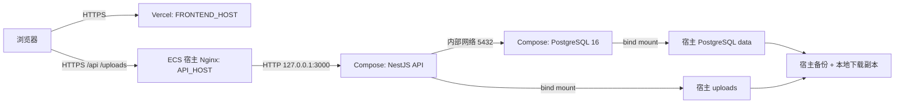

# Black-box 生产部署详细设计

> 版本：v1
>
> 日期：2026-07-19
>
> 状态：已实施并人工验收通过；D0～D8全部关闭；未自动进入第五期
>
> 定位：第四期及 O1/O2 完成后的独立生产部署设计批次；不代表第五期启动

## 一、文档定位与事实来源

本文是 Black-box 首次生产部署的权威设计，负责把已验收应用交付到“Vercel 前端 + 阿里云中国香港 ECS 后端”的短期作品展示环境。本文定义架构、安全、数据、发布、恢复、费用和验收门禁，不是逐条命令的实施计划，也不授权任何云端写入。

发生冲突时按以下顺序判断：

1. `docs/design/00-foundation.md`：现有产品、App Shell、路由和交互契约。
2. `docs/design/05-post-phase4-ux-optimization.md`、`docs/design/06-post-phase4-personal-content.md`：O1/O2 最终功能事实。
3. 当前真实代码、Prisma migrations 和最终 QA：验证实际落地状态。
4. `docs/operations/phase4-deployment.md`、`docs/operations/phase4-maintenance.md`：已存在的应用级运行与维护契约。
5. 阿里云、Vercel、Docker、PostgreSQL、Prisma、Nginx、AI 服务商官方文档：平台与基础设施事实。

根目录 `AGENTS.md` 中“7 files / 41 tests”和“my-posts/my-likes 为后续债务”的内容已过期。当前真实终态为：

- O2 已实现、已人工验收并关闭，且已在 D0 以 `feat(personal): add personal post lists` 独立提交；未进入第五期。
- 前端：16 files / 53 unit passed。
- 后端：O2关闭时为17 suites / 74 Jest passed；D1新增部署配置测试后，当前候选`RELEASE_SHA`已在D2验证为17 suites / 81 passed。
- Playwright：9 files / 51 passed。
- 我的发布 `/mine/posts`、我的收藏 `/mine/likes` 已是产品现状。

本文使用以下受控参数，不记录真实值：

- `FRONTEND_HOST`：前端正式域名，例如根域或 `www` 域名。
- `API_HOST`：`FRONTEND_HOST` 所属域名体系下的 `api` 子域名。
- `RELEASE_SHA`：经评审、测试并授权发布的 Git commit SHA。
- `IMAGE_DIGEST`：后端生产镜像归档或镜像内容摘要。

## 二、目标、范围与非目标

### 2.1 目标

1. 将 React/Vite 静态前端发布到 Vercel Production。
2. 在香港 ECS 宿主机使用 Nginx 提供 HTTPS、反向代理和基础运维入口。
3. 使用 Docker Compose 运行单个 NestJS API 容器和单个 PostgreSQL 容器。
4. 让 PostgreSQL、uploads 和备份独立于容器可写层，重建容器不丢数据。
5. 从干净生产库执行正式 migration，并按现有 seed/embedding 契约准备可展示数据。
6. 在 2 核 2GB、40GiB 的短期展示实例上控制内存、日志、磁盘和费用。
7. 为发布、备份、恢复、回滚和最终释放建立显式人工门禁。

### 2.2 明确不做

- 不引入托管 PostgreSQL、Redis、Kubernetes、云函数、自动扩容或多实例高可用。
- 不把业务 uploads 改造到 OSS/COS；它们只可作为单独授权的异机备份目的地。
- 不复制整个本地开发数据库到生产。
- 不改变路由、JWT、SSE、AI 检索、点赞收藏、评论、O1/O2 或其他业务语义。
- 不切换 embedding 模型，不改变 1536 维向量契约。
- 不为 Preview 环境建立生产数据副本或共享生产 API。
- 不在本文购买域名、开通付费资源、创建云账号、写 secret 或执行部署。
- 不设计对当前少量用户和短期展示没有收益的复杂自动化平台。

## 三、当前基线与部署差距

### 3.1 已存在

- 前端 `frontend/black_box/package.json` 使用 `tsc -b && vite build`，产物为 `dist`。
- 前端 `src/config/runtime.ts` 要求显式注入 `VITE_API_BASE_URL`。
- 后端 `backend/backend/posts/package.json` 的生产入口为 `node dist/src/main.js`。
- 后端启动前按 profile 校验数据库、JWT、公开 URL、CORS、AI、timeout 和限流变量。
- `PUBLIC_BASE_URL` 生成 `/uploads/...` 公开媒体 URL；`FRONTEND_ORIGIN` 执行精确 CORS。
- Prisma 使用 PostgreSQL，现有三份正式 migration。
- Nest 以 `process.cwd()/uploads` 作为上传写入和静态读取根目录。
- Chat 已实现 AI SDK data stream：`0:` 文本、`8:` annotation、`3:` error、`d:` finish，并有有限失败契约。
- Throttler 使用默认进程内 storage；当前单 API 容器架构可接受。
- cleanup 默认 dry-run，apply 需要 `--apply --backup-confirmed`；seed 有数据库事务和文件补偿，embedding 独立执行。

### 3.2 需要在部署实施批次新增或调整

- 当前没有 Dockerfile、Compose、Nginx、Vercel SPA rewrite 或生产 runbook。
- 当前 O2 与用户 `CLAUDE.md` 改动仍在脏工作树；生产制品不得从该工作树直接生成。
- Nest build 不会复制 `src/scripts/fixtures/phase4-demo-images`；生产镜像若承担 demo seed，必须显式把 fixture 放到编译脚本按 `__dirname` 解析的位置。
- `TRUST_PROXY` 只允许 `false|loopback`。宿主 Nginx 经 Docker 端口映射访问 Nest 时，Nest 通常看到 Docker bridge 地址而非 loopback；直接使用现状可能导致真实 IP 和按 IP 限流失真。
- Vercel Preview 没有独立后端，不能默认访问生产 API。
- DeepSeek 旧滚动别名面临官方弃用窗口；生产必须显式指定仍受支持模型并实测。
- 香港不在 OpenAI 官方 API 支持地区列表；生产不能从香港 ECS 直连 `api.openai.com`，也不能绕过地区限制。

### 3.3 部署前最小代码/配置前置

后续实施允许新增部署工程文件，并对 env 校验做一项最小、非业务改造：增加 `TRUST_PROXY=one-hop` 受控值，将 Express `trust proxy` 设置为一跳。该值仅在以下条件同时成立时使用：

1. API 容器端口只发布到宿主 `127.0.0.1:3000`。
2. 公网安全组和宿主防火墙均不开放 3000。
3. 外部请求只可能经宿主 Nginx 一跳进入 API。

不采用“信任任意代理”“信任整个 Docker 私网段”或直接公开 3000。该前置需有 env 单测和真实客户端 IP/限流验证；本轮不实施。

## 四、目标拓扑与请求链



### 4.1 域名与 URL 契约

- 前端：`https://FRONTEND_HOST`。
- API 与媒体：`https://API_HOST`。
- 前端构建变量：`VITE_API_BASE_URL=https://API_HOST/api`。
- 后端：`PUBLIC_BASE_URL=https://API_HOST`，不得带 `/api`。
- 后端：`FRONTEND_ORIGIN=https://FRONTEND_HOST`，必须是单一 origin，不带路径和尾斜杠。
- DNS：`API_HOST` 使用 A 记录指向 ECS 公网 IPv4；`FRONTEND_HOST` 按 Vercel 域名校验提供的记录配置。

浏览器只从 Vercel 下载静态页面；业务请求、SSE 和图片直接访问 `API_HOST`。Vercel 不代理 API，不承载 uploads。

### 4.2 网络暴露

| 端口 | 暴露范围 | 契约 |
|---|---|---|
| 22 | 用户当前可信公网 IP `/32` | SSH key only；公网 IP 变化时人工更新 |
| 80 | 公网 | 仅 HTTP→HTTPS 和 ACME 校验 |
| 443 | 公网 | Nginx HTTPS API/uploads |
| 3000 | 宿主 loopback | Compose 发布 `127.0.0.1:3000:3000`，不进安全组 |
| 5432 | Compose 内部网络 | 不发布宿主端口，不进安全组 |
| 3389 | 关闭 | 不恢复 RDP |

## 五、ECS 宿主机与 2GB 资源策略

### 5.1 身份与 SSH

**D4.0 实测终态：** 初次连接失败的历史根因是管理流量来源未命中当时 TCP 22 的唯一 UFW `/32` 规则，SYN 在到达 sshd 认证前被拦截；并非公钥、`authorized_keys` 权限、`MaxStartups`、conntrack、OOM 或资源故障。当前管理入口已迁移至 TCP `2222`，本机受控 Host alias 固定 deploy 身份与该端口。TUN 保持开启，经 ECS 专属规则进入代理策略组；客户端不能绑定组内具体节点是已接受的能力边界。部署期间保持当前节点不变，出口变化立即暂停，不自动增加来源或放宽 CIDR。

UFW 与阿里云安全组仅允许批准代理出口 IPv4 `/32` 访问 TCP `2222`；公网 TCP `22`、`80`、`443`、`3000`、`3389`、`5432` 均未开放，无 IPv6 SSH allow。sshd 可在主机内部继续监听 22 以保留配置兼容，但该端口不构成公网入口。修复后新鲜只读复核确认 Docker/containerd 正常、Nginx 停止、业务容器与镜像为 0、持久目录为空且权限正确、资源阈值满足、无异常监听或 failed unit；D4.0 据此关闭。

- 新建普通 `deploy` 用户，使用已验证 SSH key；禁止密码登录和 root 远程登录。
- `deploy` 只在执行经批准运维动作时使用 `sudo`。不加入 `docker` 组，因为该组等价于 root 权限。
- deploy 的 sudo 认证仍由用户在自己的交互终端完成，不配置 `NOPASSWD`。为支持已授权批次中的 agent 非交互命令，独立 drop-in 仅设置 `timestamp_type=global` 与 `timestamp_timeout=120`；agent 不接触密码，批次结束可用 `sudo -K` 立即清除缓存。该机制不替代任何 E/DB/AI/DNS/V/R 写入门禁。
- 保持 22 端口安全组为当前可信地址 `/32`；本机 SSH 走已确认的 ECS IP 直连规则，不在文档或仓库记录 IP。
- 后续连接统一使用deploy身份与已配置的`black-box-ecs` Host alias，SSH命令固定为`ssh -l deploy black-box-ecs`（SCP/SFTP/rsync同样显式指定deploy），并保持TUN开启、通过已人工验证的专属DIRECT规则直连；连接本身不再逐次申请独立S授权。所有ECS写入、数据库写入、AI费用、DNS、Vercel与释放动作仍按各自E/DB/AI/DNS/V/R门禁独立授权，连接能力不构成写入授权。
- SSH 加固固定关闭 `X11Forwarding` 与 `AllowTcpForwarding`；首批部署无 agent forwarding 用途，因此同时关闭 `AllowAgentForwarding`。若未来确有代理转发需求，必须作为独立安全变更重新评审，不能在部署过程中临时开启。
- D3.1 控制台基线确认 3389、3000、5432、80、443及IPv6 SSH均无入方向规则；公网IPv4 ICMP仅作为用户已批准的临时诊断例外保留，D8下线/收口清单必须重新核对是否移除。
- 安装系统安全更新，启用时间同步；不安装桌面、RDP 或与部署无关的软件。

### 5.2 宿主目录

```text
/srv/black-box/
  releases/          # 镜像归档、manifest，按 RELEASE_SHA 隔离
  compose/           # 当前获批 compose 与非 secret 配置
  postgres/          # PostgreSQL bind mount
  uploads/           # 原图、缩略图、头像
  backups/           # 短期宿主备份，root only
/etc/black-box/
  runtime.env        # 常驻 API：数据库、JWT、AI、URL、限流，root:root 0600
  database.env       # 一次性数据库工具：仅 DATABASE_URL，root:root 0600
  demo-seed.env      # seed-demo：仅演示用户密码，root:root 0600
  embedding.env      # embedding：仅对应 key/base/model，root:root 0600
  ai-preflight.env   # AI 预检：仅两家 provider 变量，root:root 0600
  postgres.env       # PostgreSQL 容器变量，root:root 0600
```

目录必须使用绝对路径。应用容器以固定非 root UID 运行；uploads 授予该 UID 最小读写权限。PostgreSQL 目录权限以实际镜像内 postgres UID/GID 核对后设置，不凭空写死主机 UID。

### 5.3 内存、Swap 与进程边界

- 创建 2GiB Swap，权限 `0600`，持久挂载并在重启后复核；`vm.swappiness=10`。Swap 只用于避免瞬时 OOM，不是常态容量。
- Swap运行态、权限、fstab唯一性与项目sysctl已在D3.3门禁A人工验收通过；D3.6单次重启后已真实确认自动启用约2GiB、fstab唯一且swappiness=10，D3整体验收已关闭。
- D3.3实测云厂商持久swappiness定义位于`/etc/sysctl.d/99-apsara-sysctl.conf`且当前值为0；该文件保持不变。项目使用排序更后的独立`/etc/sysctl.d/99-black-box-memory.conf`覆盖为10，实施前备份fstab、云厂商定义及完整sysctl来源清单，并验证最终唯一有效值。Swap写入与Ubuntu软件包更新是两个独立E授权，前者人工验收前不得执行后者。
- D3.5只读实测确认目标持久目录尚未创建、UID/GID 10001未占用、Docker daemon尚无独立配置、UFW inactive且规则为空；Compose仍只把API绑定宿主loopback，PostgreSQL无宿主发布端口。持久目录与Docker日志、UFW启用必须分为两个独立E授权，80/443继续留在后续独立门禁。
- D3.5门禁A已人工验收关闭：按矩阵创建持久目录，并以原子写入落地Docker默认`json-file`的`10m × 3`限制；Docker/containerd重启复验通过，Nginx logrotate、UFW和监听端口保持不变。远端临时施工证据已在仓库外保全后按精确路径清理。`postgres`当前故意保持`root:root 0700`，D4启动前必须按精确PostgreSQL镜像UID/GID复核并调整。
- D3.5门禁B已人工验收关闭：唯一入站放行为可信管理IPv4 `/32`到`22/tcp`，默认deny-in/allow-out/deny-routed，保留`IPV6=yes`但无IPv6 SSH allow；80/443/3000/3389/5432均未增加规则。第二个全新deploy会话、sudo、Docker与监听验证通过，远端临时证据在仓库外保全后已精确清理。
- D3.6已在独立授权下仅执行一次操作系统重启；boot ID变化，首次恢复uptime为19.02秒。重启后SSH/sudo、Nginx、Docker、Swap、UFW、时间同步、cloud-init、dpkg/hold、failed units、目录权限、资源与监听矩阵全部通过，配对证据已在仓库外完成SHA与manifest核验。用户人工验收后，登记的临时脚本、marker和已归档远端证据已按精确路径清理，正式配置复核无漂移，deploy sudo缓存与SSH连接均已清零；D3正式关闭，D4仍须独立方案与写入授权。
- API 容器内存上限 768MiB，Node 设置 `--max-old-space-size=512`。
- PostgreSQL 容器内存上限 640MiB；初始参数：`shared_buffers=128MB`、`max_connections=30`、`work_mem=4MB`、`maintenance_work_mem=64MB`。
- 其余内存留给 Ubuntu、Nginx、Docker、文件缓存和短时运维任务。
- migration、seed、embedding backfill 不与镜像构建、备份压缩或 cleanup 并发执行。

这些值是 2GB 单实例起始上限，不是性能承诺。出现持续 swap、OOM、数据库连接耗尽或 AI 请求堆积时先停止写入和诊断，不通过无限提高并发掩盖资源不足。

### 5.4 日志与磁盘

- Docker 使用 `json-file` rotation：每容器 `max-size=10m`、`max-file=3`。
- Nginx access/error log 使用 logrotate；不得记录 Authorization、cookie、AI key、数据库 URL 或请求正文。
- 40GiB 磁盘在 70% 使用率告警、85% 阻断发布；至少保留 8GiB 可用空间。
- 每周核对 Docker image、宿主备份、uploads、PostgreSQL 和系统日志占用；删除旧镜像或备份前必须确认有可恢复副本。

## 六、Docker、Compose 与发布制品

### 6.1 方案比较与唯一选择

| 方案 | 优点 | 缺点 | 结论 |
|---|---|---|---|
| ECS 内拉源码并构建 | 操作直观 | 2GB 内编译 Node/TypeScript/Sharp 峰值高；服务器残留源码和构建工具；失败归因困难 | 淘汰 |
| CI 构建并推镜像仓库 | 标准化、可扩展 | 首次需要仓库、凭据和额外平台配置，超出短期展示的最少运维目标 | 后续可选 |
| 干净本地 checkout 构建、归档传输 | 不压 ECS；无需镜像仓库；SHA 可核对 | 发布由人工驱动 | **采用** |

唯一发布来源为：基于已评审 `RELEASE_SHA` 的干净 checkout/worktree，在 Docker Linux builder 中构建 `linux/amd64` 多阶段镜像，导出 image archive，生成 SHA-256 和 manifest，经 SSH/SCP 直连上传；ECS 先校验 SHA-256 再 `docker load`。

禁止从当前 O2 未提交工作树构建生产制品。O2 和用户改动须先经过独立 Git 审核与提交，发布 manifest 必须能从 `RELEASE_SHA` 复现。

### 6.2 后端镜像契约

发布源必须在 Git attributes 中固定 `*.sh text eol=lf`。发布前强制核对 Git blob、干净 worktree 与 deployment bundle 三层全部 Shell 文件均为 LF、CRLF计数为0，并在Linux原生Bash执行`bash -n`。服务器 staging 转码、忽略失败脚本或放宽语法门禁均被禁止；任何换行失败直接使候选失效并要求从修正后的新提交重建完整同 SHA 制品链。

Deployment bundle 固定直接从Git对象生成：`git archive --format=tar.gz --output=<唯一.part> <RELEASE_SHA> deploy/production`，校验成功后再原子改名；不得先复制、checkout或index export到中间源码目录后再调用tar。Git for Windows的`git archive`仍会依据Git attributes与本机文本转换配置导出内容，因此“直接从Git对象生成”不能替代`*.sh text eol=lf`。自动化门禁必须实际执行同一路径，解包后证明每个Shell与对应Git blob逐字节一致。

- 构建基础镜像使用与测试兼容的受支持 Node LTS，并以不可变 digest 锁定；当前开发机 Node 24.18.0、pnpm 11.9.0 仅作为调研事实，不直接等于生产镜像选择。
- 使用 Corepack 和 lockfile frozen 安装；Linux builder 内编译 Sharp/Prisma 目标产物。
- pnpm 构建脚本只使用中间层显式 `allowBuilds` 白名单；runtime 基础层仅加入 Prisma 明确需要的 OpenSSL，不携带编译工具或临时 workspace 配置。
- 多阶段镜像仅携带生产运行依赖、`dist`、Prisma schema/migrations、维护脚本所需运行内容和 demo fixtures。
- build stage 必须复制根目录 `prisma.config.ts`，以保持容器与本地 `nest build` 均生成 `dist/src/*`；Prisma generate 使用非敏感 build-only URL，不连接真实数据库且不把该值带入 runtime。
- demo fixtures 必须位于编译后 `dist/src/scripts/fixtures/phase4-demo-images`，与 `seed-demo-posts.js` 的 `__dirname` 契约一致。
- 容器固定工作目录，确保 `process.cwd()/uploads` 指向 bind mount。
- 应用以非 root 用户运行，启动入口保持 `node dist/src/main.js`。
- 镜像标签包含完整或不歧义短 `RELEASE_SHA`；服务器不以 `latest` 作为回滚依据。

**D1 实测回填（2026-07-19）：** Node 24.18.0 Bookworm slim 与 PostgreSQL 16.14 Bookworm 已分别核对多平台 index 和 linux/amd64 manifest；PostgreSQL `05dd...` 已证实为 linux/386，不作为 amd64 依据。本地 `linux/amd64` 验证镜像已通过非 root、入口、healthcheck、native module、migration、初始化脚本与10张fixture检查；Compose默认服务与tools profile分离，并按 runtime/database/demoSeed/embedding/AI preflight 拆分最小 env 与网络；Nginx/Vercel/脚本契约和全量应用回归均通过。该镜像基于仍含D1未提交改动的验证上下文，只作为D1自动证据，不是生产候选；D2仍必须从后续干净 `RELEASE_SHA` 重建。

**D2 实测回填（2026-07-19）：** 已从候选 `RELEASE_SHA` 的仓库外 detached worktree 重建 `linux/amd64` 镜像，并在 source/restore 两套独立本地 Compose project 中完成全新库的 migration、非 AI 四步初始化、配对备份和直接恢复演练。source 与 restore 的 35 帖、13 评论、31 点赞、10 条文件记录、3 条 migration、5 游戏各 7 帖及 21 个媒体/哨兵文件均一致；恢复栈未预跑 migration/seed。两个 project 已 down，端口已释放，镜像、archive、数据库、uploads 与备份保留等待人工验收。该证据不代表生产五步初始化完成，也不授权 ECS、Vercel、DNS 或真实 AI 操作。

**D1 提交回填（2026-07-19）：** D1 经用户审查后拆为 `docs(deploy): define production release process`、`fix(config): support one-hop proxy trust`、`build(deploy): add production runtime topology` 三个本地提交；第三个提交形成候选 `RELEASE_SHA=38247ff057310e0f98125a0bbcafbfab2969877c`。提交后暂存区为空，工作树仅保留未进入发布源的用户 `CLAUDE.md` 改动；未 push、未连接 ECS、未操作数据库、AI、Vercel 或 DNS。

### 6.3 Compose 服务

| 服务 | 生命周期 | 关键契约 |
|---|---|---|
| `db` | 常驻 | PostgreSQL 16；内部网络；`pg_isready` readiness；bind mount；不发布 5432 |
| `api` | 常驻 | 等待 db ready；loopback 发布 3000；uploads bind mount；非 root；`GET /api` liveness |
| `migrate` | 一次性 | 与 api 同一镜像；执行 `prisma migrate deploy`；成功后方可启动新 api |
| `seed` | 人工一次性 | 仅明确授权后运行；不随 compose up 自动执行 |
| `embedding-backfill` | 人工一次性 | seed 成功后独立运行；外部调用失败非零退出 |
| `cleanup-dry-run` | 人工/周期只读 | 只允许默认 dry-run；不随部署自动 apply |

Compose 使用单个内部 bridge network。`depends_on: condition: service_healthy` 只解决启动顺序，不代替 migration 和业务健康验收。

### 6.4 健康语义分层

健康检查不得把“进程存在”“数据库接受连接”和“应用能完成真实只读查询”混为一件事：

| 层级 | 检查 | 能证明什么 | 不能证明什么 |
|---|---|---|---|
| Nest liveness | `GET /api` 返回 200 与现有 Hello 响应 | Nest 进程、HTTP listener 与基础路由存活 | 不访问 Prisma，不能证明数据库或帖子查询可用 |
| PostgreSQL readiness | `pg_isready` 在 Compose 内部网络成功 | PostgreSQL 已接受连接 | 不能证明 migration 完成、应用凭据正确或业务查询成功 |
| 应用/数据库 readiness | `GET /api/posts?page=1&limit=1` 返回 200，且响应含数组 `items` 与数值 `total` | 现有匿名只读接口已通过 Prisma 对真实生产库完成 count/findMany；空库同样可验证 | 不代替全部业务链路或外部 AI 验收 |
| 公网发布放行 | 经 `https://API_HOST/api/posts?page=1&limit=1` 完成同一结构断言 | DNS、TLS、Nginx、Nest、Prisma 与 PostgreSQL 的完整只读链路可用 | 不代表写入、上传、SSE 和 AI 均已通过 |

API 容器自身 healthcheck 可使用 `GET /api` 做低成本 liveness；发布脚本和人工切流门禁必须额外执行应用/数据库 readiness。`db` 为 healthy 仅允许继续检查，不允许直接宣告应用可用。本文不新增业务健康接口，也不改变现有帖子接口语义。

## 七、PostgreSQL、migration 与生产数据

### 7.1 版本和持久化

- 固定 PostgreSQL 16；其官方支持期至 2028-11-09，覆盖当前短期展示窗口。
- 实施时锁定 PostgreSQL 16 当前安全 minor 的镜像 digest，升级 minor 前先备份和恢复演练。
- PG16 bind mount 精确挂到 `/var/lib/postgresql/data`，不得误挂父目录形成匿名 volume。
- 健康检查使用 `pg_isready`；数据库只在 Compose 网络内可达。

### 7.2 migration 门禁

1. 新建空生产数据库和最小权限应用用户。
2. 对当前 `RELEASE_SHA` 所含 migration history 做只读清单核对。
3. 在隔离副本先执行 `prisma migrate deploy`。
4. 正式执行前创建空库基线备份；执行后核对 `prisma migrate status` 与 schema。
5. 仅 migration 成功，且 `GET /api/posts?page=1&limit=1` 应用/数据库 readiness 通过，才允许进入 seed 门禁。

生产禁止 `prisma migrate dev`、`db push`、手工改表或导入本地全库。migration 失败立即停止；不尝试在线逆向 SQL，恢复空库备份或重建干净库后定位。

### 7.3 全新作品展示生产库初始化

本节只窄范围覆盖 `docs/operations/phase4-maintenance.md` 中“生产数据库禁止运行 demo seed”的旧口径：**仅对尚未承载任何用户数据、专门用于本次作品展示的全新生产库**，允许在逐步授权、备份和验证下完成一次初始化。该例外不适用于已有生产库、恢复后的生产库或已经开放写入的库；部署、容器启动和后续发布都不得自动执行任何 seed。

固定顺序如下，前一步成功并通过只读核对后才可申请下一步授权：

```text
prisma migrate deploy
  → seed-games
  → rebuild-tags
  → seed-demo
  → embedding backfill
```

| 顺序 | 生产入口 | 最小依赖 | 幂等/重跑语义 | 失败与授权边界 |
|---|---|---|---|---|
| 1. migration | `pnpm exec prisma migrate deploy` | `DATABASE_URL`、镜像内 Prisma CLI、`prisma/schema.prisma` 与完整 migrations | 只应用尚未执行的正式 migration；已应用项不会重复执行 | 数据库写入独立授权。非零立即停止，不启动 seed；只用 `migrate status` 与应用/数据库 readiness 放行 |
| 2. 游戏目录 | `node dist/src/scripts/seed-games.js` | 已迁移数据库、`DATABASE_URL`、编译脚本和 Prisma Client | 按唯一游戏名 upsert；重跑更新描述且不覆盖 cover，技术上可重跑 | 全新库目录初始化独立授权。任一 upsert 异常即非零并停止；核对固定 5 个游戏后方可继续 |
| 3. 内容类型标签 | `node dist/src/scripts/rebuild-tags.js` | 已迁移数据库、`DATABASE_URL`、编译脚本；执行前必须只读确认 Post/PostTag 均为 0 | 在空库可重复得到固定 5 个标签；脚本会先删除全部 PostTag 和 Tag，**对已有帖子不具备安全幂等性** | 破坏性目录初始化独立授权。非零立即停止；因当前脚本不是单事务，失败时重建全新空库或从该步前备份恢复，不在已有库自动重试 |
| 4. 演示数据 | `node dist/src/scripts/seed-demo-posts.js` | 前两类目录完整、`DATABASE_URL`、`DEMO_USER_PASSWORD`、可写 uploads、编译后 fixtures | 仅按 manifest 作者+标题和 fixture originalname 定向替换；可在专用演示库复跑，但会重建 manifest 数据和推进主键，不是一般生产维护命令 | 数据库+文件真实写入独立授权。Prisma transaction 只覆盖数据库；仅本次新建文件参与补偿。非零或补偿失败即停止并报告残留 |
| 5. 标题向量 | `node dist/src/scripts/backfill-embeddings.js` | seed 成功、`DATABASE_URL`、兼容 embedding key/base/model、1536维预检通过 | 全新库使用无参数模式，只补 `titleEmbedding == null`，成功项可保留且失败项可重跑；不使用 `--all` 无故重复外部调用 | 外部费用与数据库写入独立授权。单帖失败继续但最终非零；只要存在 null、非有限值或非1536维就不放行 |

**生产进度回填（2026-07-23）：** 上表第1步migration已在D4.4唯一执行并通过，禁止重跑。第2步`seed-games`、第3步`rebuild-tags`、B2 `post-DB3 / pre-demo`与第4步`seed-demo`均已分别执行、验证并人工验收；DB-4终态为5 User、35 Post、35 PostTag、13 Comment、31 Like、10 File、20媒体、35条null embedding和0条non-null embedding，B2有效，API停止、原db healthy。D4.7-A / AI-1已唯一执行一次正式预检并人工验收通过。D4.7-B方案与无费用只读预检也已完成且供应商调用为0，但当前候选缺少完整body deadline和写前1536维有限数校验，禁止执行backfill。D4.7-B、B3及后续D4暂停，先按`docs/design/09-production-embedding-write-safety.md`生成新候选并重新通过零写入门禁。

**生产终态回填（2026-07-27）：** 09批次已生成并部署新候选；唯一无参数backfill完成35/35条1536维有限数向量，B3远端/本地副本及API loopback恢复通过。上述2026-07-23段落保留为历史门禁证据，不再代表当前状态。

**D4.5-A1方案回填（2026-07-23）：** `seed-games`真实入口为FIX镜像内`node dist/src/scripts/seed-games.js`，按`Game.name @unique`顺序upsert固定5个游戏，已存在时只更新描述、不覆盖cover。脚本不是单事务，失败可能留下前缀数据；因此DB-2只能单独执行一次，失败保留现场且不得自动重跑、恢复或进入DB-3。完整施工与只读预检矩阵见`docs/qa/production-deployment/d4-db2-seed-games-plan.md`。

每个停点必须记录目标库身份、命令入口、开始/结束时间、退出码和只读结果，不记录连接串或 secret。任何一步失败都禁止自动进入下一步；一份“初始化整批授权”也不得解释为允许跳过中间失败停点。

初始化前生成空库/空 uploads 恢复点；seed-demo 前再生成一次数据库+uploads 配对备份。demo seed 的数据库事务和文件补偿不能组成跨系统原子事务，补偿失败必须非零并人工恢复。embedding 独立于 seed；若失败，可保留已 seed 数据但整体发布门禁不通过，供应商恢复后只重跑补缺模式，或恢复 seed 前配对备份。

终态必须核对固定游戏与标签、帖子、演示用户、评论、点赞、媒体记录、空正文、重复标题，以及每条 embedding 的 1536 个有限数值。已有生产库若将来需要补数据，必须另立迁移/维护设计，不得复用本初始化序列。

## 八、uploads、cleanup 与文件恢复

### 8.1 持久化契约

整个宿主 `/srv/black-box/uploads` 挂载到容器固定工作目录下的 `uploads`，必须同时保留：

- 帖子原图 `uploads/{base}.jpg`。
- 帖子缩略图 `uploads/resized/{base}-thumbnail.jpg`。
- 头像 `uploads/avatar/resized/{base}-small.jpg|large.jpg`。

容器重启、替换镜像和回滚不得改变这些路径。目录默认不允许公开列举，Nginx 仍把 `/uploads/` 代理给 Nest 静态服务，避免形成第二套媒体路径逻辑。

### 8.2 上传与权限

- Nginx `client_max_body_size` 固定 6MiB，与应用 5MB 单文件验证留 multipart 开销余量。
- API 用户对 uploads 有最小读写权限，PostgreSQL 用户无权限，Nginx 不直接写入。
- 上传失败、Sharp 处理失败和数据库写失败继续遵守现有补偿语义。
- 上线前用真实头像和帖子图片验证原图、缩略图 URL、容器重启持久性和坏图 fallback。

### 8.3 cleanup

生产例行任务只运行 dry-run 并保存候选明细。任何 apply 都必须单独满足：停写、数据库+uploads 配对备份、SHA-256、归档可读验证、候选未漂移、用户对唯一命令明确授权。不得把 cleanup apply 放进 deploy、cron 或 seed。

## 九、Nginx、HTTPS、真实 IP 与 SSE

### 9.1 HTTPS

- `API_HOST` 的 80 仅用于 ACME 校验和 301 到 HTTPS；业务只走 443。
- 证书使用受支持 ACME 客户端签发并配置自动续期；上线门禁包含续期 dry-run。
- Vercel 在域名验证后为 `FRONTEND_HOST` 管理 TLS；两端均禁止生产 HTTP 混合内容。
- TLS 私钥只在 ECS root 受控目录，不进入仓库、镜像或备份清单正文。

### 9.2 代理通用契约

- 转发 `Host`、`X-Real-IP`、`X-Forwarded-For`、`X-Forwarded-Proto`。
- Nginx 是唯一公网反向代理；Nest 通过受控 `one-hop` 读取真实客户端 IP。
- 一般 API 使用合理连接/读取超时；上传上限 6MiB；禁止目录浏览。
- `/api` 与 `/uploads` 都由 `API_HOST` 提供；根路径可只返回最小健康说明，不承载前端。

### 9.3 Chat data stream

`/api/ai/chat` 使用独立 location：

- `proxy_http_version 1.1`。
- `proxy_buffering off`、`proxy_cache off`、禁用该响应压缩。
- `proxy_read_timeout` 与 `proxy_send_timeout` 均至少 75 秒，覆盖现有 55 秒客户端兜底并留网络余量。
- 不改写 `Content-Type: text/plain`、`x-vercel-ai-data-stream: v1`、`Cache-Control: no-cache` 或流式 part。

上线必须同时用命令行检查响应头和浏览器验证逐步出现文本、annotation 引用及 finish；“最终一次性收到整段文本”视为代理缓冲故障。

## 十、Vercel 前端发布

### 10.1 项目设置

- Monorepo Root Directory：`frontend/black_box`。
- Framework Preset：Vite。
- Install：锁定 pnpm/lockfile，使用 frozen lockfile。
- Build：`pnpm build`。
- Output Directory：`dist`。
- 新增项目根 `vercel.json`，把非静态资源请求 rewrite 到 `/index.html`，保证 React Router 深链刷新。

Vercel 官方支持 monorepo Root Directory、Vite 构建和项目级 rewrite；具体实现文件在部署实施批次创建，本轮不改配置。

### 10.2 Production 与 Preview

| 环境 | `VITE_API_BASE_URL` | 数据边界 |
|---|---|---|
| Production | `https://API_HOST/api` | 唯一生产 API |
| Preview | 保留无效受控值 `https://api.invalid/api` | 静态与视觉预览；不得访问生产 API |
| Local development | 本地 `.env.local` 显式值 | 不进入 Vercel |

当前没有 Preview 后端，因此采用 fail-closed，而不是把所有 Vercel Preview origin 加入 CORS。生产后端只允许 `https://FRONTEND_HOST`，Vercel 自动生成域名不是生产受信 origin。

### 10.3 发布顺序

先完成 API_HOST DNS、HTTPS、PostgreSQL readiness、应用/数据库 readiness 和 CORS 预检，再发布 Vercel Production。前端构建变量属于编译时值，API 域名改变必须重新构建；不能通过运行时修改静态产物补救。

### 10.4 前后端同源发布溯源

一次生产发布只有在前后端均来自同一个已审核 `RELEASE_SHA` 时才成立：

- 后端镜像 manifest 记录 `RELEASE_SHA`、`IMAGE_DIGEST`、构建时间和基础镜像 digest。
- Vercel Production 必须从同一 `RELEASE_SHA` 生成；Git integration 的 production branch 当前状态不能替代 commit 核验。
- 发布前从 Vercel deployment metadata 核对 source commit SHA 与 `RELEASE_SHA` 完全一致；不一致即停止切流。
- 发布记录包含 Vercel deployment ID、immutable deployment URL、Production alias、source commit SHA、构建变量的名称/环境/“已设置且通过校验”状态，以及上一个已验收 rollback deployment ID/URL。记录不得包含 secret 值。
- `VITE_API_BASE_URL` 虽不是 secret，仍按 Production scope 和受控 `API_HOST` 契约核对；Preview 配置单独记录，不得混入 Production 构建。
- 后端镜像和 Vercel deployment 作为一个 release pair 验收。只回滚一侧前必须核对 API/前端兼容性；常规回滚优先切回该 release pair 对应的上一后端镜像与 Vercel deployment。

若 Vercel 由 Git 自动部署，执行者仍须在正式 alias 切换前读取 deployment metadata 完成 SHA 核验；“分支最新部署成功”不是发布证据。

## 十一、secret、AI 可用性与合规预检

### 11.1 secret 注入

| 范围 | 变量/凭据 | 注入位置 |
|---|---|---|
| ECS API | `DATABASE_URL`、`TOKEN_SECRET`、DeepSeek/OpenAI key/base/model、公开 URL、CORS、timeout、限流 | `/etc/black-box/runtime.env`，root:root 0600；常驻进程不持有 seed 密码 |
| 数据库工具 | `DATABASE_URL` | `/etc/black-box/database.env`；仅接入内部数据库网络 |
| Demo seed | `DATABASE_URL` + `DEMO_USER_PASSWORD` | `database.env` + `/etc/black-box/demo-seed.env`；仅 seed-demo 一次性进程注入，不接外网 |
| Embedding | `DATABASE_URL` + OpenAI-compatible key/base/model | `database.env` + `/etc/black-box/embedding.env`；仅该工具接数据库与外网 |
| AI preflight | DeepSeek/OpenAI-compatible key/base/model，不含数据库/JWT/seed 密码 | `/etc/black-box/ai-preflight.env`；仅接外网 |
| Vercel | `VITE_API_BASE_URL` | Vercel Environment Variables |
| 云账号/Vercel | 账号凭据、SSH 私钥、DNS 权限 | 用户账户或本机密钥系统，不进入 ECS env |

文档、manifest、日志和命令历史只记录变量名及“已设置/未设置”，不回显值。`TOKEN_SECRET` 使用高熵随机值且满足现有强校验；轮换会使现有 JWT 失效。数据库密码需高熵，放入 URL 前正确编码。AI key 只授予所需 API，部署结束后可单独轮换。

### 11.2 DeepSeek

DeepSeek 官方已公告旧 `deepseek-chat`/`deepseek-reasoner` 别名在 2026-07-24 15:59 UTC 弃用。生产必须显式设置经官方确认仍可用的 `DEEPSEEK_MODEL=deepseek-v4-flash`，不能依赖代码默认旧别名。

开放用户流量前，从 ECS 发一次不含用户数据的最小流式调用，核对 DNS/TLS、HTTP 状态、首 token 时间、完整 finish 和成本；同时查官方状态页。失败时按现有 Chat 有限失败展示，不尝试绕过服务商限制。

### 11.3 embedding

- 模型保持 `text-embedding-3-small`，维度必须为 1536。
- 生产供应商固定为302.AI OpenAI-compatible API；用户已明确接受帖子标题与搜索关键词由该供应商处理。禁止回退或直接调用OpenAI官方地址，禁止自动切换模型或供应商。
- `OPENAI_BASE_URL`必须包含兼容API版本段，调用方再追加`/embeddings`；不得重复或遗漏版本段。真实endpoint、域名值、key和账号信息只进入ECS受控env，不进入Git文档或QA。
- 从 ECS 对中性短文本发一次最小 embedding，请求成功后验证数组长度 1536、元素全为有限数；失败不得 seed/backfill，也不得私自换模型。
- 302.AI 提供兼容 embedding 与按量计费，但其条款把当地及上游合规责任留给用户；技术可达不等于获得合规放行。

## 十二、备份、恢复、回滚与下线

### 12.1 配对备份

每次 migration、seed、cleanup apply 和有数据语义的发布前，在同一停写窗口生成：

1. PostgreSQL custom-format dump。
2. uploads tar.gz。
3. manifest：时间、`RELEASE_SHA`、镜像 digest、migration 清单、绝对备份路径、大小和 SHA-256。

宿主备份目录仅作短期第一副本；至少把最新变更前配对备份下载到用户本机仓库外的受控位置。分别运行 `pg_restore --list` 与 `tar -tzf` 验证可读。OSS/COS 只在用户单独授权后作为额外异机副本，不替代本地下载。

### 12.2 隔离恢复演练

- 使用不同 Compose project、不同宿主目录和非生产端口。
- 恢复数据库和 uploads 后，使用备份 manifest 对应镜像启动。
- 验证 migration、登录、媒体、帖子、评论、点赞/O2 列表、Search/Chat 有限行为。
- 任何恢复命令先证明目标路径不是生产目录；未通过演练的备份不能作为唯一恢复依据。

### 12.3 回滚

- 纯应用回滚：数据库向后兼容时切回上一 `RELEASE_SHA` 镜像，依次通过 liveness 与应用/数据库 readiness 后恢复 Nginx 流量。
- migration/seed/cleanup 回滚：停写，恢复同一恢复点的数据库和 uploads，再启动与其匹配的镜像。不得只恢复数据库或只恢复文件。
- AI 供应商故障不触发数据回滚；按有限失败契约降级并暂停 embedding 写入。
- 发布失败时保留失败 manifest 和日志摘要，但不得包含 secret。

### 12.4 最终下线

1. 停止用户写入，生成并下载最终配对备份，核验 SHA-256 和归档可读性。
2. 移除 DNS 或切换到下线页，撤销 Vercel Production 环境变量/域名（是否保留项目由用户决定）。
3. 释放 ECS，而非仅停止实例；再独立核对并释放按量磁盘、快照、EIP、公网带宽等资源。
4. 撤销或轮换 AI key、数据库口令、SSH key 和云/Vercel访问凭据。
5. 在账单控制台于 24 小时和 72 小时后复核无持续费用。

## 十三、费用、监控与告警

用户提供的 ECS 试用事实：0.167 元/小时、300 元额度，理论连续运行约 `300 / 0.167 = 1796.4` 小时，即约 74.9 天。实际额度还可能受其他收费项影响，因此不能把 2026-10-19 试用有效期当作免费运行终点；阿里云账单和试用中心是唯一结算依据。

### 13.1 告警

- 额度使用 50%、75%、90% 时人工告警；每周查一次余额和预计耗尽日期。
- CPU 连续 5 分钟 ≥80% 告警。
- 内存 ≥85% 告警；持续 swap 或 OOM 为发布阻塞。
- 系统盘 ≥70% warning、≥85% critical；critical 时停止发布和大文件写入。
- Nest liveness、应用/数据库 readiness、Nginx 5xx、PostgreSQL readiness 和证书到期分别监测，不合并成单一状态。

### 13.2 可能独立计费的资源

ECS 计算、系统/数据盘、快照、EIP、公网出流量、备份对象存储、域名、Vercel 超额及 AI 调用需分别核对。当前不默认创建 EIP、云快照或 OSS/COS；若公网 IP 稳定性要求促使创建 EIP，必须由用户单独确认价格和释放责任。

## 十四、文件职责矩阵

以下是后续实施预期触及面，不代表本轮已经创建：

| 文件/目录 | 状态 | 未来职责 |
|---|---|---|
| `docs/design/07-production-deployment.md` | 本轮新增 | 生产部署权威设计 |
| `.planning/production-deployment/` | 本轮新增 | 调研、进度和设计决策记录 |
| `frontend/black_box/vercel.json` | 需要新增 | SPA rewrite，不承载 secret |
| `backend/backend/posts/Dockerfile` | 需要新增 | linux/amd64 多阶段生产镜像、fixtures、非 root运行 |
| `backend/backend/posts/.dockerignore` | 需要新增 | 排除本地 env、uploads、测试产物和无关文件 |
| `deploy/production/compose.yaml` | 需要新增 | api/db/migrate/seed 的单实例编排与资源限制 |
| `deploy/production/nginx/black-box.conf` | 需要新增 | HTTPS、反向代理、SSE、上传上限和真实 IP |
| `deploy/production/runtime.env.example`、`database.env.example`、`demo-seed.env.example`、`embedding.env.example`、`ai-preflight.env.example` | 需要新增 | 按常驻 API、数据库工具、demo seed、embedding、AI 预检拆分最小变量，不含真实值 |
| `deploy/production/README.md` | 需要新增 | 经批准后形成操作 runbook、门禁与恢复路径 |
| `backend/backend/posts/src/config/env.ts` | 需要最小改造 | 增加受控 `one-hop` 代理值，不改变业务变量语义 |
| `backend/backend/posts/src/config/env.spec.ts` | 需要修改 | 锁定 one-hop 接受/拒绝边界 |
| `backend/backend/posts/src/main.ts` | 需要最小改造 | 将 one-hop 映射到 Express trust proxy 1 |
| Prisma schema/migrations | 明确不改 | 新库只执行已有 migration history |
| 前后端业务页面/API/store | 明确不改 | 部署不得借机改变产品功能 |
| `CLAUDE.md`、现有 O2 脏改动 | 保护 | 不覆盖、不隐式纳入未经审核的发布制品 |

若实施时发现 Docker/Prisma 运行必须改变 dependency 或 lockfile，须暂停并单独说明；本设计不预授权依赖变更。

## 十五、职责与授权矩阵

| 事项 | 执行 agent | 用户 | 决策/验收方 |
|---|---|---|---|
| 设计、实施计划、部署文件草案 | 编写并自测，不接触 secret | 提供约束 | 审核范围与安全边界 |
| O2 Git 收口与 `RELEASE_SHA` | 只按明确授权提交 | 确认用户改动边界 | 审核 diff 与测试证据 |
| 域名购买、DNS、Vercel/ECS账号 | 不代购、不记录凭据 | 亲自完成或逐项授权 | 核对生效结果 |
| secret 生成和注入 | 只提供变量契约，不回显值 | 亲自设置 | 确认“已设置”与校验通过 |
| 安全组 80/443、SSH /32 | 提交变更方案后等待授权 | 明确授权真实写入 | 复核暴露面 |
| Docker/Nginx/PostgreSQL安装 | 按实施检查点执行 | 授权 ECS 写入 | 验证版本、来源和回滚点 |
| migration | 先备份/演练/报告 | 对目标库明确授权 | 验收状态和数据边界 |
| seed/backfill | 先报调用量和成本 | 单独授权真实写入 | 验收 manifest 和1536维 |
| cleanup apply | 默认禁止 | 配对备份后授权唯一命令 | 核对候选与执行结果 |
| Production 发布/切流 | 提供 SHA、测试和回滚证据 | 明确授权 | 完整链路人工验收 |
| 购买 EIP/快照/OSS 等 | 不自动创建 | 确认持续费用 | 核对账单和释放责任 |
| 下线和资源释放 | 先完成最终备份 | 对每类资源授权 | 24/72 小时复核账单 |

任何真实写入、购买、DNS、secret、migration、seed、发布、cleanup apply 或释放动作都不得由“设计已确认”自动推导授权。

## 十六、验证与最终验收

### 16.1 自动门禁

发布候选必须从干净 `RELEASE_SHA` 运行并记录：

- 前端 unit：至少保持 16 files / 53 passed。
- 后端 Jest：至少保持 17 suites / 74 passed。
- Playwright：至少保持 9 files / 51 passed。
- 前后端生产 build 成功。
- 差分 lint 不新增问题；历史债如实记录，不表述为全仓 lint 通过。
- Docker 镜像构建、非 root 运行、healthcheck、SHA-256 和 manifest 校验成功。
- `GET /api` liveness、`pg_isready` 与 `GET /api/posts?page=1&limit=1` 应用/数据库 readiness 分别成功；报告不得把三者合并为单一“健康”。
- `prisma migrate deploy/status` 在隔离库成功。
- Nginx config test、证书续期 dry-run、Compose config 展开检查成功且不输出 secret。
- Vercel deployment metadata 的 source commit SHA 与后端 `RELEASE_SHA` 一致，release pair 已记录 deployment ID/immutable URL、镜像 digest 和双方回滚目标。
- 部署配置静态扫描：无真实 IP、域名值、密码、key、数据库 URL 或私钥。

### 16.2 基础设施与持久化验收

- 公网仅 80/443；22 仍为授权 `/32`；3000/5432/3389 不可公网访问。
- API、db 健康；重启 api、重建 api、重启 ECS 后数据库与 uploads 均保持。
- 真实客户端 IP 在 Nest/限流日志的脱敏诊断中正确，两个不同来源不被错误合并。
- 数据库与 uploads 配对备份有绝对路径、大小、时间、SHA-256，且归档可读。
- 隔离恢复演练可启动匹配镜像并通过核心只读链路。
- cleanup dry-run orphan 候选可解释；未获授权不执行 apply。

### 16.3 Vercel 与四视口

Production 对当前 9 个页面在 `1440×1000`、`900×1000`、`390×844`、`320×740` 共 36 个默认态进行人工截图验收：Home、Search、PostDetail、Compose、Chat、Mine、Login、MyPosts、MyLikes。检查 App Shell 三态、移动底栏、安全区、Markdown 局部滚动、个人列表分页和无页面级横向溢出。

深链刷新必须返回 SPA；Preview 请求生产 API 必须失败关闭；Production 只向 `API_HOST` 发请求且无 mixed content、CORS 或 console error。

### 16.4 真实业务链路

1. 注册、登录、token 刷新和退出。
2. Home tag×game、分页、详情返回和滚动恢复。
3. Compose Markdown、图片上传、详情媒体和容器重启持久性。
4. PostDetail 点赞、评论、回复、删除确认与错误反馈。
5. Mine 头像上传时序、我的发布、我的收藏、分页、详情跳转和取消点赞返回一致性。
6. Search 真实 embedding：有限时间内成功，或进入明确 ErrorState 并可重试，不得无限 loading。
7. Chat：JWT、SSE 增量文本、assistant Markdown、annotation 引用；检索超时可降级，无响应时客户端有限失败，不得永久生成。
8. 危险 Markdown/XSS、长代码/表格、坏图、空态、首屏错误和翻页错误继续符合已验收契约。

AI 真实调用只使用最小非敏感内容并记录状态/耗时，不记录 prompt 正文或 key。供应商不可达、地区不允许、embedding 非1536维、SSE 被缓冲、无限 loading、数据不持久、错误 CORS 或公网暴露数据库均为发布阻塞。

## 十七、失败处置与回滚原则

- 自动门禁失败：停止，不修云端状态来掩盖本地代码失败。
- 镜像哈希不一致：删除该次服务器归档并重新传输；不加载、不启动。
- migration/seed/cleanup 失败：停止写入，保留证据，按配对恢复点处理；不自动重试有副作用命令。
- Vercel 成功但 API 未就绪：不把 Production 域名切给用户；先回滚前端 deployment 或恢复上一 API。
- AI 预检失败：保留普通业务验收，整体发布仍不通过；不绕过地区或切换模型。
- 内存/磁盘告警：停止 seed/build/压缩等重任务，必要时回滚并由用户决定升级实例，不临时增加复杂架构。
- 任何范围外业务缺口、数据库语义变化或新付费资源需求：暂停并回到设计/授权门禁。

## 十八、官方依据

- Vercel：[Monorepo Root Directory](https://vercel.com/docs/monorepos)、[Vite](https://vercel.com/docs/frameworks/frontend/vite)、[环境变量](https://vercel.com/docs/environment-variables)、[部署环境](https://vercel.com/docs/deployments/environments)、[`vercel.json`](https://vercel.com/docs/project-configuration/vercel-json)、[自定义域名与 SSL](https://vercel.com/docs/domains/set-up-custom-domain)。
- Docker：[Ubuntu 安装](https://docs.docker.com/engine/install/ubuntu/)、[Compose plugin](https://docs.docker.com/compose/install/linux/)、[Buildx](https://docs.docker.com/reference/cli/docker/buildx/build/)、[启动顺序](https://docs.docker.com/compose/how-tos/startup-order/)、[日志轮换](https://docs.docker.com/engine/logging/drivers/json-file/)。
- PostgreSQL：[版本支持策略](https://www.postgresql.org/support/versioning/)、[官方 Docker 镜像](https://hub.docker.com/_/postgres)、[Ubuntu PGDG APT仓库](https://www.postgresql.org/download/linux/ubuntu/)、[`pg_dump`主版本兼容](https://www.postgresql.org/docs/16/app-pgdump.html)。
- Ubuntu：[OpenSSH Server](https://documentation.ubuntu.com/server/how-to/security/openssh-server/)、[Server系统要求](https://documentation.ubuntu.com/server/reference/installation/system-requirements/)。
- Prisma：[生产 migration 命令](https://docs.prisma.io/docs/cli/migrate)、[migration history](https://www.prisma.io/docs/orm/prisma-migrate/understanding-prisma-migrate/migration-histories)。
- Nginx：[HTTP proxy module](https://nginx.org/en/docs/http/ngx_http_proxy_module.html)、[client body limit](https://nginx.org/en/docs/http/ngx_http_core_module.html)。
- 阿里云：[安全组入门](https://www.alibabacloud.com/help/en/ecs/user-guide/start-using-security-groups)、[安全组场景](https://www.alibabacloud.com/help/en/ecs/user-guide/security-groups-for-different-use-cases)、[监控与日志](https://www.alibabacloud.com/help/en/ecs/user-guide/monitoring-and-logging)、[磁盘监控](https://www.alibabacloud.com/help/en/ecs/user-guide/view-the-monitoring-data-of-a-disk)、[账单明细](https://www.alibabacloud.com/help/en/ecs/view-billing-details)、[免费试用](https://www.alibabacloud.com/help/en/user-center/product-overview/learn-about-free-trials)、[释放实例](https://help.aliyun.com/en/ecs/user-guide/release-an-instance)、[DNS A 记录](https://www.alibabacloud.com/help/en/dns/pubz-add-parsing-record)。
- AI：[DeepSeek API 与模型公告](https://api-docs.deepseek.com/)、[DeepSeek 状态](https://status.deepseek.com/)、[OpenAI 支持地区](https://help.openai.com/en/articles/5347006-openai-api-supported-countries-and-territories)、[302.AI embeddings](https://doc-en.302.ai/323761393e0)、[302.AI 条款](https://price.302.ai/terms/)。

## 十九、设计验收清单

- [x] 用户确认 `FRONTEND_HOST`/`API_HOST` 参数契约及域名取得方式。
- [x] 用户确认干净 `RELEASE_SHA` 是唯一发布源，当前脏工作树不直接部署。
- [x] 用户确认本地 Buildx 构建、镜像归档+SHA 传输的唯一发布方案。
- [x] 用户确认 PostgreSQL 16、宿主 bind mount 和不公开 5432。
- [x] 用户确认全新作品展示库的五步初始化顺序、逐步授权，以及已有生产库禁止自动 seed。
- [x] 用户确认 `/api` 只作 liveness，PostgreSQL 和真实 Prisma readiness 分层放行。
- [x] 用户确认 `TRUST_PROXY=one-hop` 是部署前最小配置前置。
- [x] 用户确认 Preview fail-closed，不访问生产 API。
- [x] 用户确认 Vercel Production 与后端镜像必须来自同一 `RELEASE_SHA`，并以 release pair 回滚。
- [x] 用户确认 DeepSeek 显式模型及香港 ECS 的 AI/embedding 合规预检门禁。
- [x] 用户确认 migration、seed/backfill、cleanup apply、Production 切流均需独立授权。
- [x] 用户确认配对备份、本地下载副本、隔离恢复和回滚契约。
- [x] 用户确认费用告警、最终下线和独立计费资源清理责任。
- [x] 本文无真实 IP、域名值、口令、key、连接串或私钥。
- [x] 本文无模糊占位词或隐式范围扩张。

本文已通过人工评审，下一步是独立生产部署实施计划；设计确认本身不授权云端、DNS、secret、数据库或发布写入。

## 二十、当前实施状态（截至2026-07-23）

- 旧候选`38247ff057310e0f98125a0bbcafbfab2969877c`因Shell换行契约缺失正式失效，禁止继续使用其镜像、bundle或远端staging。
- 新候选固定为`6e182d477da82a74a0a447bfc7e1f1d77aa4faed`。该SHA的D1发布基线、linux/amd64镜像、D2 source/restore隔离恢复及D4.0本地传输制品已重新建立，并经用户人工验收通过。
- 本地重建未调用AI或embedding，未连接ECS，未清理旧现场，也未恢复D4.1。该人工验收只关闭本地制品链，不自动授权ECS写入、数据库、secret、DNS、Vercel或Production切流。

### D4.4关闭回填（2026-07-23）

- D4.4历史阻塞保留：旧候选在60秒SIGTERM后exit 137、OOM=false。该镜像不再具备发布资格。
- 08批次以`FIX_RELEASE_SHA=72350a77acf59ad179b9a89b19544c162033e0ae`完成生命周期与backup边界TDD、完整回归、同SHA制品重建、隔离恢复、ECS导入、生产兼容、API切换、生产SIGTERM和pre-DB2配对备份，并获用户最终人工验收。
- 08批次关闭时的生产快照：FIX API与原db healthy；API仅绑定loopback；三条migration已完成，九张业务表为空，DB-2尚未执行。该项是D4.5-A2写入前历史基线。
- B0、B1和“F6 release / pre-DB2”恢复点有效；旧镜像、旧release、F4/F5现场与失败证据继续保留。
- D4.4正式关闭后，下一门禁曾为D4.5 DB-2 `seed-games`方案/独立写入授权；该项是A1/A2执行前历史状态，不覆盖下列最新进度。
- D4.5-A1施工方案与完整只读预检已人工验收通过：FIX API与原db均healthy，三条migration保持finished，九张业务表仍为空，远端/本地pre-DB2恢复点完整可读，uploads为空且资源满足门禁。用户当时独立授权D4.5-A2执行一次DB-2 `seed-games`；D4.5-B继续专指DB-3 `rebuild-tags`。该条是A1时点的历史授权记录，当前状态以下方DB-3实施回填为准。
- D4.5-A2已唯一执行一次并获用户人工验收：Docker one-off事件链为create/start/die/destroy且`exitCode=0`，数据库精确包含5个批准游戏、名称唯一，其他8张业务表仍为0，三条migration与空uploads均未变化。API按门禁保持停止，原db为running+healthy；D4.5-B未授权或执行。执行证据见`docs/qa/production-deployment/d4-db2-seed-games-report.md`。
- D4.5-B方案与完整只读预检已完成：FIX、原db、停止API、3条migration、5个批准游戏、Post/PostTag/Tag=0、空uploads、pre-DB2恢复点及资源均未漂移。`rebuild-tags`固定先删PostTag、再删Tag、最后创建资讯/攻略/求助/评测/活动，且无外层事务；失败恢复只能回到seed-games之前并重新逐项授权。B2必须在DB-3人工验收后另行授权创建。详见`docs/qa/production-deployment/d4-db3-rebuild-tags-plan.md`。
- D4.5-B唯一写入的历史实施快照：命令实际执行1次并以退出码0结束；Tag精确为资讯、攻略、求助、评测、活动且唯一，PostTag与其他非目标业务表保持0，5个Game、3条migration、空uploads及pre-DB2恢复点未漂移。唯一one-off事件链为create/attach/start/die(0)/destroy，API仍停止且原db healthy。该项随后已获人工验收并完成B2；seed-demo仍未执行。证据见`docs/qa/production-deployment/d4-db3-rebuild-tags-report.md`。
- 用户已人工验收通过D4.5-B / DB-3，并独立授权仅创建、验证和下载B2 `post-DB3 / pre-demo`配对恢复点。该授权不包含seed-demo、embedding、AI、cleanup、restore或migration。
- B2首次且唯一获授权执行在FIX备份脚本创建目录、停止API与dump之前失败：外层门禁脚本把变量声明为readonly后又以同名临时环境赋值，导致子脚本未取得绝对`BACKUP_ROOT`。没有B2 complete/`.incomplete`、远端导出或本地副本；未执行任何数据库业务写入或后续初始化。当前等待独立恢复授权，证据见`docs/qa/production-deployment/d4-b2-backup-stoppage.md`。
- 用户授权恢复后，仅修正外层变量传递并使用全新唯一目标；远端B2已完成，四项文件、内部SHA、dump/tar、manifest、权限及3 migration/5 Game/5 Tag/空业务数据快照全部通过。唯一默认SFTP下载最终失败，本地只留下0字节`database.dump`，没有重试或切换协议；远端正式B2与导出均保留，等待独立传输恢复决策。seed-demo仍未执行。
- 本地副本retry1授权要求先清除sudo timestamp；该唯一SSH会话在本地超时且没有返回完成标记，故无法证明远端sudo缓存状态。按再次超时即停约束未建立后续连接、未创建retry1目录、未发起SFTP；历史失败目录与远端B2均保持，seed-demo仍未执行。
- 本地副本retry2已明确完成`sudo -K`并以`sudo -n true`退出1证明缓存清除；随后远端B2四项文件只读复核会话非零且无元数据输出。按失败即停未创建新本地目录或发起SFTP，未重跑备份或进入seed-demo。
- 本地副本retry3在重新验证sudo缓存有效后，于正式B2首项SHA输出解析时因`cut`参数错误退出；失败早于远端导出目录创建。本次未复制文件、未清除sudo缓存、未创建本地retry1目录或发起SFTP，seed-demo仍未执行。
- 本地副本retry4不再使用`cut`，但首项核对后的`printf`格式串被远端shell误解释为管道并退出；仍早于导出目录创建。未复制、未下载、未进入seed-demo。
- 本地副本retry5将所有远端动作拆为离散命令；前三项文件全部匹配且`SHA256SUMS`存在，但其独立`stat`命令超时。未创建导出或下载；安全收尾已确认sudo timestamp清除，seed-demo仍未执行。
- 受控自主retry6通过已审查的一次性脚本完成正式B2只读核对、deploy-owned导出与默认SFTP下载；本地四项大小/SHA、内部清单、dump、tar和manifest语义全部通过。用户已人工验收通过B2，正式恢复点与本地副本保留；deploy导出仅按精确路径清理，seed-demo未执行。
- D4.6 / DB-4设计采用FIX镜像的唯一`seed-demo`入口：仅注入database/demo-seed env、内部db网络和uploads mount，无外网。它只定向替换manifest演示数据；文件先创建并记录本次新增路径，数据库写入由单个Prisma transaction覆盖，失败仅补偿本次新增文件。计划终态为5作者、35帖、35 PostTag、13评论、31点赞、10 File、20媒体且embedding全空。完整方案与预检矩阵见`docs/qa/production-deployment/d4-db4-seed-demo-plan.md`。
- DB-4生产只读预检已完成：FIX镜像与原db身份、停止API、3 migration、5 Game、5 Tag、其余业务与embedding为0、空uploads、B2、demo env、Compose、10 fixtures、资源和无tool残留全部通过。deploy传输导出已精确清理，正式B2与本地副本保留。当前停在DB-4独立数据库/uploads写入授权门禁，`seed-demo`实际调用次数为0。
- 用户独立授权后，DB-4正式Compose命令仅调用1次并退出0；唯一one-off事件链为create/attach/start/die(0)/destroy。终态为5 User、35 Post、35 PostTag、13 Comment、31 Like、10 File、20个固定媒体共404899 bytes且embedding为0；3 migration、5 Game、5 Tag与B2不变。API保持停止、原db healthy，无tool残留。用户已人工验收通过DB-4；该通过不自动授权B3、AI preflight或embedding。
- D4.7-A / AI-1固定使用FIX release内`ai-preflight` tools service：仅注入`ai-preflight.env`并加入`egress_net`，无数据库网络、DATABASE_URL、JWT、seed密码或uploads。正式门禁最多一次DeepSeek最小流式请求与一次302.AI `text-embedding-3-small`请求；完整deadline、无自动重试、1536维有限数和脱敏输出契约见`docs/qa/production-deployment/d4-ai1-preflight-plan.md`。
- D4.7-A无费用只读预检已通过FIX、env、Compose最小权限、容器、DB-4数据、20媒体、B2、资源及通用DNS/TLS；未访问供应商业务接口，真实调用为0。已知非Shell文本CRLF表示经只读规范化后与FIX Git blob精确一致，不构成内容漂移；当前只停在AI-1独立费用授权门禁。
- 用户独立授权后，AI-1正式Compose命令仅调用1次并退出0：DeepSeek最小流式请求完整结束、耗时1578ms；302.AI最小embedding请求耗时591ms，结果精确1536维且全部有限。唯一one-off为create/attach/start/die(0)/destroy；DB-4、20媒体及B2不变，API停止、原db healthy。AI-1已人工验收通过；该结果不自动授权D4.7-B或35帖embedding。
- D4.7-B / DB-5 + AI-2方案与无费用只读预检确认当前35条embedding全为null、标题合计722字符/2070 UTF-8 bytes，Compose最小权限、生产数据、媒体、B2与资源无漂移，供应商请求0。真实脚本逐帖串行且关闭LangChain/OpenAI SDK自动重试，但当前timeout不能证明覆盖完整body，写库前也未验证1536维和有限数；正式backfill因此阻塞，须先完成窄范围脚本修复、新候选重建与重新部署。详见`docs/qa/production-deployment/d4-db5-embedding-backfill-plan.md`。

### D6 实现状态（2026-07-27）

- 固定`RELEASE_SHA`已推送到独立发布分支；远端默认分支和当前脏工作树未进入发布源。
- Vercel Production已从该完整SHA构建为Ready/Current制品，Root Directory、Vite、Production/Preview变量分层符合本设计。
- 用户完成`FRONTEND_HOST`权威DNS写入后，平台显示Valid Configuration且TLS可用；真实DNS值仍只保存在受控平台。
- 正式Home真实数据、精确CORS、SPA深链、匿名路由守卫及1440/900/390/320四档无页面级横向溢出已通过自动验证。
- 前端deployment与后端镜像形成同SHA release pair；用户已完成正式域名人工验证，D6已人工验收关闭。D7已完成自动矩阵、36张Production截图、受控真实写链路、Search/Chat调用及生产只读终态审计，并于2026-07-28通过用户最终人工验收；D8已完成上线后备份、runbook、费用、下线演练、主机告警和通知可达性验证，07生产部署批次正式关闭。
- 新候选人工通过后已完成一次ECS新鲜只读门禁：管理alias保持deploy/TCP 2222，当前来源匹配唯一批准`/32`；Docker/containerd、Nginx、UFW、资源、持久目录和旧现场均无漂移，新SHA release/compose/staging路径不存在。该只读通过不授权D4.1写入。

### D8 运维交接状态（2026-07-28）

- D7已完成自动矩阵、36张Production截图、受控真实链路和生产终态审计，并获用户最终人工验收。
- D8.1已创建上线后database/uploads配对恢复点，并完成远端与仓库外本地副本的SHA、dump、tar及manifest验证；备份后API/db恢复healthy，生产数据和uploads无漂移。
- 运维runbook已按当前事实收敛为TCP 2222受控alias、SHA级Compose目录、分层健康、证书续期、配对备份/恢复、AI与停写故障处置、费用清单和下线流程。
- D8.3书面下线演练已完成，未实际释放ECS、磁盘、快照、EIP、DNS、Vercel或任何凭据。
- D8.2已安装并验证LoongCollector 4.0.0，CPU、内存和磁盘三条实例告警已启用并绑定既有联系人组；唯一临时通知测试规则触发后，用户确认实际收到通知，临时规则已删除且三条正式规则保持不变。阿里云站点监控属于新增按量计费能力，未获授权所以未开通，API/db/Nginx/证书保持runbook主机侧与人工检查；该范围边界不阻塞验收。
- D8.0～D8.4均已实施并通过用户人工验收，07生产部署设计正式关闭；不自动进入第五期，不自动提交Git。
